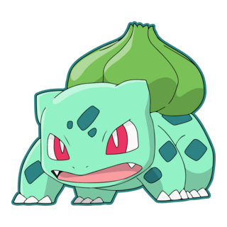
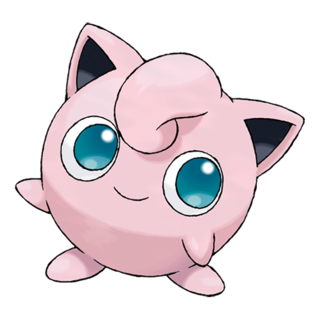
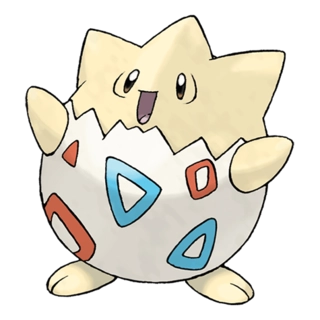

  
  
  
  
  
  

# Sliding Puzzle 🧩
Sliding puzzle game with AI solver.
Click on a tile to slide it.
The solver uses A*  search algorithm.
[Play](https://odimos.github.io/sliding-puzzle-solver/)

## A* Search
Evaluation function: f(n) = g(n) + h(n)
- g(n): number of moves made so far
- h(n): sum of the horizontal and vertical distances of each tile from its goal position
  (Manhattan distance)

## Technologies
HTML, CSS, Javascript
